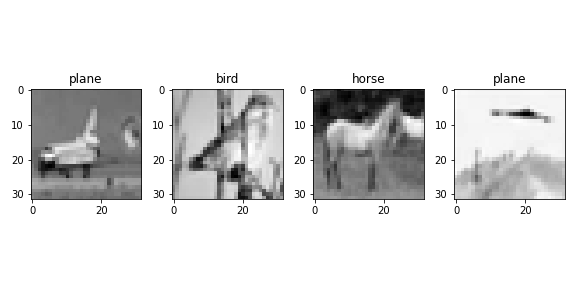

# CIFAR-10 dataset Image Classification using AutoEncoder as Feature Extractor

A) The CIFAR-10 dataset consists of 60000 32x32 colour images in 10 classes, with 6000 images per class. * There are 50000 training images and 10000 test images.

B)     The dataset is divided into five training batches and one test batch, each with 10000 images.

C)     The test batch contains exactly 1000 randomly-selected images from each class.

D)     The training batches contain the remaining images in random order, but some training batches may contain more images from one class than another. Between them, the training batches contain exactly 5000 images from each class.

E)     These are the classes in the dataset:

        1. airplane
        2. automobile
        3. bird
        4. cat
        5. deer
        6. dog
        7. frog
        8. horse
        9. ship
        10.truck

F) The classes are completely mutually exclusive. i.e. There is no overlap between automobiles and trucks. "Automobile" includes sedans, SUVs, things of that sort. "Truck" includes only big trucks. Neither includes pickup trucks.


##### hyper parameter


```python
batch_size = 512
num_epochs = 100
learning_rate = 0.01
```


##### check classes in the dataset


    {0: 'airplane',
     1: 'automobile',
     2: 'bird',
     3: 'cat',
     4: 'deer',
     5: 'dog',
     6: 'frog',
     7: 'horse',
     8: 'ship',
     9: 'truck'}


##### check images avialable for each image classes


    Distribution of classes: 
     {'airplane': 5000, 'automobile': 5000, 'bird': 5000, 'cat': 5000, 'deer': 5000, 'dog': 5000, 'frog': 5000, 'horse': 5000, 'ship': 5000, 'truck': 5000}


##### length of the training and testing data


    Old train set :: 50000
    New train set :: 42500
    test set :: 10000


##### Plotting Images


    

    


---
##### Train the model


    

    


    

    


##### Compare the ground truth vs Prediction


    Ground Truth : Predicted 


    

    


##### Check Accuracy of the netwrok


    Accuracy of the network on the 10000 test images: 63 %


##### Cheeck the accuracy of each class in the dataset


    Accuracy for class: plane is 71.7 %  [717/1000]
    Accuracy for class: car   is 86.2 %  [862/1000]
    Accuracy for class: bird  is 33.1 %  [331/1000]
    Accuracy for class: cat   is 43.2 %  [432/1000]
    Accuracy for class: deer  is 58.9 %  [589/1000]
    Accuracy for class: dog   is 52.0 %  [520/1000]
    Accuracy for class: frog  is 59.5 %  [595/1000]
    Accuracy for class: horse is 83.5 %  [835/1000]
    Accuracy for class: ship  is 77.4 %  [774/1000]
    Accuracy for class: truck is 70.6 %  [706/1000]


##### plot the Confusion matrix of the predicted score


    

    


##### classification report of the data


    

    


### end
