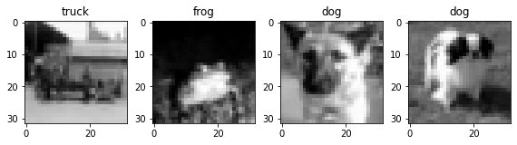
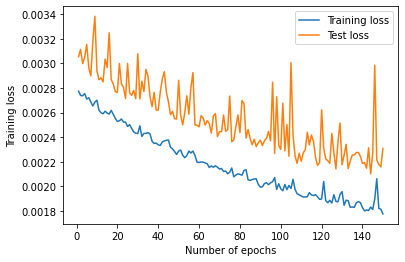
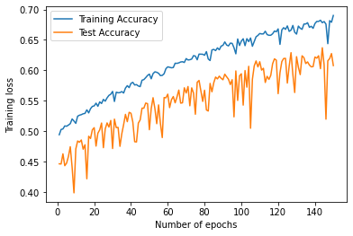
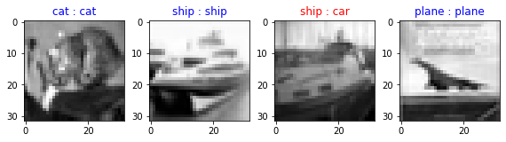
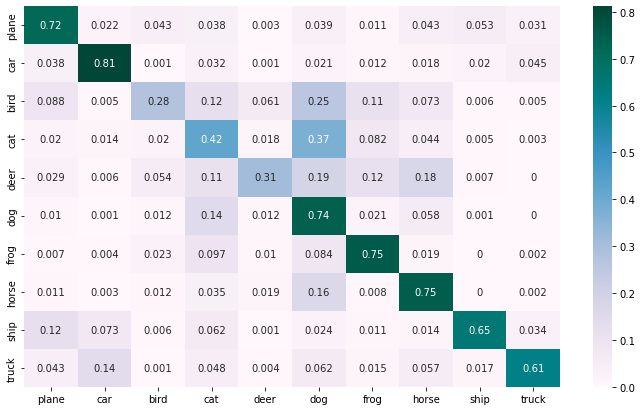
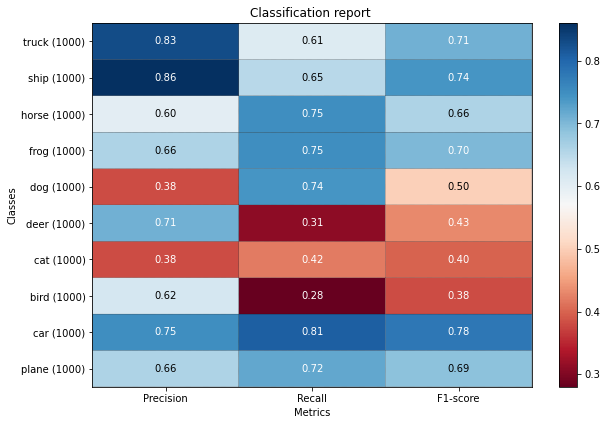

# CIFAR-10 dataset Image Classification using AutoEncoder as Feature Extractor

A) The CIFAR-10 dataset consists of 60000 32x32 colour images in 10 classes, with 6000 images per class. * There are 50000 training images and 10000 test images.

B)     The dataset is divided into five training batches and one test batch, each with 10000 images.

C)     The test batch contains exactly 1000 randomly-selected images from each class.

D)     The training batches contain the remaining images in random order, but some training batches may contain more images from one class than another. Between them, the training batches contain exactly 5000 images from each class.

E)     These are the classes in the dataset:

        1. airplane
        2. automobile
        3. bird
        4. cat
        5. deer
        6. dog
        7. frog
        8. horse
        9. ship
        10.truck

F) The classes are completely mutually exclusive. i.e. There is no overlap between automobiles and trucks. "Automobile" includes sedans, SUVs, things of that sort. "Truck" includes only big trucks. Neither includes pickup trucks.

### Approach

Imported dataset

Analysed data


##### Import Libraries


```python
import torch
import torchvision
import torchvision.transforms as transforms
import numpy as np
import os
import time
from torch.utils.data import Subset
import matplotlib.pyplot as plt
```

##### Check if CUDA is availaible


```python
device = torch.device('cuda:0' if torch.cuda.is_available() else 'cpu')

if not device:
    print(device, ' :: CUDA is not available. Training on CPU ...')
else:
    print(device, ' :: CUDA is available! Training on GPU')
    
print("GPU :: Available :",torch.cuda.device_count())
print("\nGPU ::",torch.cuda.get_device_name())
kwargs = {'num_workers': 1, 'pin_memory': True} if device=='cuda:0' else {}

```

    cuda:0  :: CUDA is available! Training on GPU
    GPU :: Available : 1
    
    GPU :: NVIDIA GeForce RTX 3090


##### hyper parameter


```python
batch_size = 512
# num_epochs = 30
learning_rate = 0.001
```

##### Load CIFAR-10 dataset


```python
transform = transforms.Compose(
            [transforms.ToTensor(),
            transforms.Normalize((0.5, 0.5, 0.5), (0.5, 0.5, 0.5))])


# load training dataset 50000 images 5000 for each class(total 10 class)
trainset = torchvision.datasets.CIFAR10(root='./data', train=True,
                                        download=True, transform=transform)
trainloader = torch.utils.data.DataLoader(trainset, batch_size=batch_size,
                                          shuffle=True, **kwargs)
# Load test dataset 10000 images , 1000 for each class
testset = torchvision.datasets.CIFAR10(root='./data', train=False,
                                       download=True, transform=transform)
testloader = torch.utils.data.DataLoader(testset, batch_size=batch_size,
                                         shuffle=False, **kwargs)

classes = ('plane', 'car', 'bird', 'cat',
           'deer', 'dog', 'frog', 'horse', 'ship', 'truck')


```

    Files already downloaded and verified
    Files already downloaded and verified


##### check classes in the dataset


```python
idx2class = {v: k for k, v in trainset.class_to_idx.items()}
idx2class
```


    {0: 'airplane',
     1: 'automobile',
     2: 'bird',
     3: 'cat',
     4: 'deer',
     5: 'dog',
     6: 'frog',
     7: 'horse',
     8: 'ship',
     9: 'truck'}


##### check images avialaible for each image classes


```python
def get_class_distribution(dataset_obj):
    count_dict = {k:0 for k,v in dataset_obj.class_to_idx.items()}
    
    for element in dataset_obj:
        y_lbl = element[1]
        y_lbl = idx2class[y_lbl]
        count_dict[y_lbl] += 1
            
    return count_dict
print("Distribution of classes: \n", get_class_distribution(trainset))

```

    Distribution of classes: 
     {'airplane': 5000, 'automobile': 5000, 'bird': 5000, 'cat': 5000, 'deer': 5000, 'dog': 5000, 'frog': 5000, 'horse': 5000, 'ship': 5000, 'truck': 5000}


---
#### Selecting desired images for each classes for training

we want **bird=deer=truck=2500** images for training that is 50% of the training images per class in the dataset i.e. 5000.


```python
bird_indices, deer_indices, truck_indices, other_indices = [], [], [], []
bird_idx, deer_idx, truck_idx = trainset.class_to_idx['bird'], trainset.class_to_idx['deer'], trainset.class_to_idx['truck']

for i in range(len(trainset)):
  current_class = trainset[i][1]
  if current_class == bird_idx:
    bird_indices.append(i)
  elif current_class == deer_idx:
    deer_indices.append(i)
  elif current_class == truck_idx:
    truck_indices.append(i)
  else:
    other_indices.append(i)
    
#select the number of images required for training in our case its 50%
#therefore 0.5* len(xx_indices)
bird_indices = bird_indices[:int(0.5 * len(bird_indices))]
deer_indices = deer_indices[:int(0.5 * len(deer_indices))]
truck_indices = truck_indices[:int(0.5 * len(truck_indices))]
new_dataset = Subset(trainset, bird_indices+deer_indices+truck_indices+other_indices)

```

##### Load the new created subset into the Dataloader for training


```python
newtrainloader = torch.utils.data.DataLoader(new_dataset, batch_size=batch_size,
                                          shuffle=True, num_workers=2)
```

##### print datatype and length of the training and testing data


```python
# print("Old train set ::",trainset)
print("Old train set ::",len(trainset))


# print("New train set ::",new_dataset)
print("New train set ::",len(new_dataset))

# print("test loader ::",testset)
print("test set ::",len(testset))
```

    Old train set :: 50000
    New train set :: 42500
    test set :: 10000


##### Plotting Images


```python
# get some random training images
dataiter = iter(newtrainloader)
images, labels = dataiter.next()
images = images.numpy()
# plotting first 64 images
fig = plt.figure(figsize=(8,8))

for i in range(4):
    ax = fig.add_subplot(4, 4, i+1)
    ax.imshow(images[i][0],  cmap = 'gray')#cmap = plt.cm.bone)
    ax.set_title(classes[labels[i]])
plt.tight_layout()
plt.show()
```


    

    


---
### Network model

##### Autoencoder model


```python
import torch.nn as nn
import torch.nn.functional as F
```

##### Instantiate the model


```python


class Net(nn.Module):
    def __init__(self,num_classes=6):
        super(Net,self).__init__()
        
        # ENCODER
        self.encoder = nn.Sequential(
            nn.Conv2d(in_channels=3,out_channels=4, kernel_size=3,stride=1,padding=1,),      
            nn.ReLU(),   # 4x32x32
            nn.Conv2d(in_channels=4,out_channels=8, kernel_size=3,stride=1,padding=1,),
            nn.ReLU(),   # 8x32x32
            nn.MaxPool2d(kernel_size=2),# 8x16x16     
            nn.Conv2d(in_channels=8,out_channels=16, kernel_size=5,stride=1,padding=2,),
            nn.ReLU(),   #8x16x16

        )

         # DECODER
        self.decoder = nn.Sequential(
            nn.ConvTranspose2d(in_channels=16,out_channels=8,kernel_size=2,stride=2,padding=0,),     
            nn.ReLU(),    
            nn.Conv2d(in_channels=8,out_channels=8,kernel_size=5,stride=1,padding=2,),      
            nn.ReLU(),
            
            nn.ConvTranspose2d(in_channels=8,out_channels=4,kernel_size=5,stride=1,padding=2,),     
            nn.ReLU(),    
            nn.Conv2d(in_channels=4,out_channels=4,kernel_size=5,stride=1,padding=2,),      
            nn.ReLU(),
            
            nn.ConvTranspose2d(in_channels=4,out_channels=4,kernel_size=2,stride=2,padding=0,),     
            nn.ReLU(),    
            nn.Conv2d(in_channels=4,out_channels=4,kernel_size=3,stride=1,padding=1,),      
            nn.ReLU(),
            
            nn.ConvTranspose2d(in_channels=4,out_channels=3,kernel_size=5,stride=1,padding=2,),     
            nn.Conv2d(in_channels=3,out_channels=3,kernel_size=3,stride=1,padding=1,),      
            nn.ReLU(),
        )
        
        
        self.cnn_layers = nn.Sequential(
            nn.Conv2d(16, 32, 3,1),
            nn.Conv2d(32, 64, 3,1),
            nn.MaxPool2d(2, 2),
            nn.Dropout2d(0.2),
            nn.Conv2d(64, 128, 3),
            nn.Conv2d(128,256,3,1),
#             nn.MaxPool2d(2, 2),
            nn.Dropout2d(0.2),
            nn.Conv2d(256,512,2,1),
            nn.Dropout2d(0.2),
        )
        self.linear_layers= nn.Sequential(
            nn.Linear(512 * 1 * 1, 128),
            nn.Linear(128, 64),
            nn.Linear(64, 16),
            
        )


    def forward(self, x):
        encoded = self.encoder(x)
#         print("encoded ::", encoded.shape)
#         decoded = self.decoder(encoded)
#         out = self.classifier(x)
        out = self.cnn_layers(encoded)
#         print("CNN ::", out.shape)
        out = out.view(out.size(0), -1)
#         print("CNN resize ::", out.shape)
        out = self.linear_layers(out)
        return out      


net = Net()
net = net.to(device)
```


```python
# net.eval()
```

---
#### Loss function

Loss function (criterion) decides how the output can be compared to a class, which determines how good or bad the neural network performs. And the optimizer chooses a way to update the weight in order to converge to find the best weights in this neural network.

#'ASGD': optim.ASGD(net.parameters(), lr)}

#'Adam': optim.Adam(net.parameters(), lr)

#'SGD': optim.SGD(net.parameters(), lr, momentum=0.9)


```python
import torch.optim as optim

criterion = nn.CrossEntropyLoss()
optimizer = optim.SGD(net.parameters(), lr=learning_rate, momentum=0.9)
```

---
##### Train the model


```python
num_epochs = 250
trainloss=[]
trainaccuracy=[]
testloss=[]
testaccuracy=[]

start_time = time.time()


for epoch in range(num_epochs):  # loop over the dataset multiple times
    
    train_loss=0.0
    train_accuracy=0.0
    test_loss=0.0
    test_accuracy=0.0

    for i, data in enumerate(newtrainloader, 0):
        # get the inputs; data is a list of [inputs, labels]
        inputs, labels = data

        # zero the parameter gradients
        optimizer.zero_grad()
        if torch.cuda.is_available():
            inputs = inputs.to('cuda')
            labels = labels.to('cuda')
#             net.to('cuda')
        
        # forward + backward + optimize
        outputs = net(inputs)
        loss = criterion(outputs, labels)
        loss.backward()
        optimizer.step()

        # print statistics
        train_loss += loss.item()
        
        _,prediction=torch.max(outputs.data,1)
        train_accuracy+=int(torch.sum(prediction==labels.data))
        
    for j, datal in enumerate(testloader, 0):
        # get the inputs; data is a list of [inputs, labels]
        inputsl, labelsl = datal

        # zero the parameter gradients
        optimizer.zero_grad()
        if torch.cuda.is_available():
            inputsl = inputsl.to('cuda')
            labelsl = labelsl.to('cuda')

        outputss = net(inputsl)
        testloss_ = criterion(outputss, labelsl)
        # print statistics
        test_loss += testloss_.item()

        _,predictionl=torch.max(outputss.data,1)
        test_accuracy+=int(torch.sum(predictionl==labelsl.data))
        
    # calculate average accuracy and losses
    test_loss = test_loss/len(testloader.sampler)
    test_accuracy = test_accuracy/len(testloader.sampler)
    train_accuracy = train_accuracy/len(newtrainloader.sampler)
    train_loss = train_loss/len(newtrainloader.sampler)
#     print("Epoch :",epoch, "Train Loss :", train_loss)
    print(f'Epoch : [{epoch + 1}, {i + 1:5d},{j + 1:5d}] loss: {train_loss:.6f} \
    Acc: {train_accuracy:.6f}, test-L: {test_loss:.6f} test-A: {test_accuracy:.6f}')
    
    trainloss.append(train_loss)
    trainaccuracy.append(train_accuracy)
    testloss.append(test_loss)
    testaccuracy.append(test_accuracy)


elapsed = (time.time() - start_time)/60
print(f'Total Training Time: {elapsed:.2f} min')


print('Finished Training')
```

    Epoch : [1,    84,   20] loss: 0.002774     Acc: 0.494259, test-L: 0.003055 test-A: 0.446500
    Epoch : [2,    84,   20] loss: 0.002739     Acc: 0.502941, test-L: 0.003114 test-A: 0.446200
    Epoch : [3,    84,   20] loss: 0.002736     Acc: 0.503765, test-L: 0.002998 test-A: 0.462900
    Epoch : [4,    84,   20] loss: 0.002755     Acc: 0.508729, test-L: 0.003050 test-A: 0.443400
    Epoch : [5,    84,   20] loss: 0.002710     Acc: 0.508212, test-L: 0.003155 test-A: 0.447700
    Epoch : [6,    84,   20] loss: 0.002721     Acc: 0.510165, test-L: 0.002967 test-A: 0.458700
    Epoch : [7,    84,   20] loss: 0.002686     Acc: 0.512471, test-L: 0.002899 test-A: 0.474600
    Epoch : [8,    84,   20] loss: 0.002654     Acc: 0.520165, test-L: 0.003180 test-A: 0.440900
    Epoch : [9,    84,   20] loss: 0.002685     Acc: 0.516800, test-L: 0.003384 test-A: 0.398800
    Epoch : [10,    84,   20] loss: 0.002701     Acc: 0.512965, test-L: 0.002940 test-A: 0.470900
    Epoch : [11,    84,   20] loss: 0.002619     Acc: 0.524729, test-L: 0.002867 test-A: 0.484000
    Epoch : [12,    84,   20] loss: 0.002598     Acc: 0.526353, test-L: 0.002883 test-A: 0.482000
    Epoch : [13,    84,   20] loss: 0.002590     Acc: 0.527247, test-L: 0.002849 test-A: 0.485600
    Epoch : [14,    84,   20] loss: 0.002611     Acc: 0.528706, test-L: 0.003035 test-A: 0.470500
    Epoch : [15,    84,   20] loss: 0.002596     Acc: 0.529318, test-L: 0.002967 test-A: 0.477800
    Epoch : [16,    84,   20] loss: 0.002587     Acc: 0.535176, test-L: 0.003249 test-A: 0.421900
    Epoch : [17,    84,   20] loss: 0.002618     Acc: 0.530165, test-L: 0.002867 test-A: 0.491800
    Epoch : [18,    84,   20] loss: 0.002585     Acc: 0.537012, test-L: 0.002833 test-A: 0.488100
    Epoch : [19,    84,   20] loss: 0.002553     Acc: 0.540824, test-L: 0.002771 test-A: 0.502400
    Epoch : [20,    84,   20] loss: 0.002528     Acc: 0.541624, test-L: 0.002764 test-A: 0.505800
    Epoch : [21,    84,   20] loss: 0.002534     Acc: 0.546141, test-L: 0.002999 test-A: 0.475600
    Epoch : [22,    84,   20] loss: 0.002547     Acc: 0.540988, test-L: 0.002833 test-A: 0.496800
    Epoch : [23,    84,   20] loss: 0.002523     Acc: 0.548235, test-L: 0.002806 test-A: 0.502300
    Epoch : [24,    84,   20] loss: 0.002522     Acc: 0.545600, test-L: 0.002714 test-A: 0.513500
    Epoch : [25,    84,   20] loss: 0.002487     Acc: 0.552329, test-L: 0.003000 test-A: 0.473000
    Epoch : [26,    84,   20] loss: 0.002502     Acc: 0.549365, test-L: 0.002762 test-A: 0.503800
    Epoch : [27,    84,   20] loss: 0.002471     Acc: 0.554800, test-L: 0.002740 test-A: 0.513700
    Epoch : [28,    84,   20] loss: 0.002442     Acc: 0.558894, test-L: 0.002780 test-A: 0.506900
    Epoch : [29,    84,   20] loss: 0.002432     Acc: 0.560776, test-L: 0.002713 test-A: 0.517700
    Epoch : [30,    84,   20] loss: 0.002428     Acc: 0.565435, test-L: 0.003079 test-A: 0.471600
    Epoch : [31,    84,   20] loss: 0.002492     Acc: 0.548894, test-L: 0.002710 test-A: 0.519900
    Epoch : [32,    84,   20] loss: 0.002405     Acc: 0.564141, test-L: 0.002855 test-A: 0.506000
    Epoch : [33,    84,   20] loss: 0.002430     Acc: 0.563200, test-L: 0.002771 test-A: 0.506300
    Epoch : [34,    84,   20] loss: 0.002430     Acc: 0.563482, test-L: 0.002952 test-A: 0.475200
    Epoch : [35,    84,   20] loss: 0.002437     Acc: 0.565153, test-L: 0.002896 test-A: 0.495800
    Epoch : [36,    84,   20] loss: 0.002425     Acc: 0.562753, test-L: 0.002728 test-A: 0.510900
    Epoch : [37,    84,   20] loss: 0.002365     Acc: 0.570918, test-L: 0.002648 test-A: 0.527700
    Epoch : [38,    84,   20] loss: 0.002349     Acc: 0.574871, test-L: 0.002765 test-A: 0.515700
    Epoch : [39,    84,   20] loss: 0.002351     Acc: 0.571647, test-L: 0.002621 test-A: 0.531100
    Epoch : [40,    84,   20] loss: 0.002338     Acc: 0.578635, test-L: 0.002620 test-A: 0.529500
    Epoch : [41,    84,   20] loss: 0.002333     Acc: 0.580306, test-L: 0.002766 test-A: 0.515100
    Epoch : [42,    84,   20] loss: 0.002360     Acc: 0.576000, test-L: 0.002872 test-A: 0.482800
    Epoch : [43,    84,   20] loss: 0.002369     Acc: 0.576588, test-L: 0.002932 test-A: 0.482400
    Epoch : [44,    84,   20] loss: 0.002374     Acc: 0.574353, test-L: 0.002767 test-A: 0.513400
    Epoch : [45,    84,   20] loss: 0.002376     Acc: 0.573318, test-L: 0.002689 test-A: 0.518700
    Epoch : [46,    84,   20] loss: 0.002318     Acc: 0.583882, test-L: 0.002582 test-A: 0.537900
    Epoch : [47,    84,   20] loss: 0.002304     Acc: 0.584824, test-L: 0.002610 test-A: 0.537900
    Epoch : [48,    84,   20] loss: 0.002283     Acc: 0.588047, test-L: 0.002550 test-A: 0.546300
    Epoch : [49,    84,   20] loss: 0.002258     Acc: 0.591647, test-L: 0.002547 test-A: 0.545300
    Epoch : [50,    84,   20] loss: 0.002287     Acc: 0.593812, test-L: 0.002862 test-A: 0.502500
    Epoch : [51,    84,   20] loss: 0.002295     Acc: 0.586188, test-L: 0.002578 test-A: 0.537200
    Epoch : [52,    84,   20] loss: 0.002252     Acc: 0.594659, test-L: 0.002500 test-A: 0.555100
    Epoch : [53,    84,   20] loss: 0.002233     Acc: 0.597624, test-L: 0.002598 test-A: 0.537300
    Epoch : [54,    84,   20] loss: 0.002249     Acc: 0.596847, test-L: 0.002736 test-A: 0.512400
    Epoch : [55,    84,   20] loss: 0.002286     Acc: 0.595200, test-L: 0.002587 test-A: 0.543300
    Epoch : [56,    84,   20] loss: 0.002271     Acc: 0.591365, test-L: 0.002802 test-A: 0.512800
    Epoch : [57,    84,   20] loss: 0.002286     Acc: 0.591741, test-L: 0.002925 test-A: 0.489600
    Epoch : [58,    84,   20] loss: 0.002251     Acc: 0.594471, test-L: 0.002499 test-A: 0.555400
    Epoch : [59,    84,   20] loss: 0.002196     Acc: 0.602824, test-L: 0.002497 test-A: 0.554900
    Epoch : [60,    84,   20] loss: 0.002194     Acc: 0.605788, test-L: 0.002483 test-A: 0.560900
    Epoch : [61,    84,   20] loss: 0.002198     Acc: 0.605059, test-L: 0.002574 test-A: 0.538800
    Epoch : [62,    84,   20] loss: 0.002196     Acc: 0.604235, test-L: 0.002556 test-A: 0.551800
    Epoch : [63,    84,   20] loss: 0.002189     Acc: 0.604635, test-L: 0.002498 test-A: 0.557000
    Epoch : [64,    84,   20] loss: 0.002183     Acc: 0.611718, test-L: 0.002534 test-A: 0.546700
    Epoch : [65,    84,   20] loss: 0.002153     Acc: 0.611482, test-L: 0.002511 test-A: 0.556300
    Epoch : [66,    84,   20] loss: 0.002165     Acc: 0.612329, test-L: 0.002433 test-A: 0.567600
    Epoch : [67,    84,   20] loss: 0.002155     Acc: 0.613765, test-L: 0.002572 test-A: 0.546200
    Epoch : [68,    84,   20] loss: 0.002167     Acc: 0.614212, test-L: 0.002592 test-A: 0.546700
    Epoch : [69,    84,   20] loss: 0.002155     Acc: 0.612965, test-L: 0.002405 test-A: 0.571400
    Epoch : [70,    84,   20] loss: 0.002140     Acc: 0.619365, test-L: 0.002444 test-A: 0.562800
    Epoch : [71,    84,   20] loss: 0.002145     Acc: 0.617082, test-L: 0.002445 test-A: 0.573500
    Epoch : [72,    84,   20] loss: 0.002120     Acc: 0.617482, test-L: 0.002580 test-A: 0.541800
    Epoch : [73,    84,   20] loss: 0.002124     Acc: 0.618588, test-L: 0.002448 test-A: 0.571300
    Epoch : [74,    84,   20] loss: 0.002102     Acc: 0.624212, test-L: 0.002460 test-A: 0.562600
    Epoch : [75,    84,   20] loss: 0.002114     Acc: 0.623388, test-L: 0.002734 test-A: 0.527900
    Epoch : [76,    84,   20] loss: 0.002149     Acc: 0.617388, test-L: 0.002364 test-A: 0.580400
    Epoch : [77,    84,   20] loss: 0.002077     Acc: 0.626706, test-L: 0.002376 test-A: 0.583400
    Epoch : [78,    84,   20] loss: 0.002091     Acc: 0.626612, test-L: 0.002483 test-A: 0.566100
    Epoch : [79,    84,   20] loss: 0.002101     Acc: 0.626471, test-L: 0.002581 test-A: 0.549000
    Epoch : [80,    84,   20] loss: 0.002097     Acc: 0.624847, test-L: 0.002436 test-A: 0.567400
    Epoch : [81,    84,   20] loss: 0.002090     Acc: 0.630776, test-L: 0.002698 test-A: 0.535000
    Epoch : [82,    84,   20] loss: 0.002129     Acc: 0.618729, test-L: 0.002674 test-A: 0.533200
    Epoch : [83,    84,   20] loss: 0.002134     Acc: 0.616141, test-L: 0.002392 test-A: 0.578600
    Epoch : [84,    84,   20] loss: 0.002053     Acc: 0.633529, test-L: 0.002462 test-A: 0.564800
    Epoch : [85,    84,   20] loss: 0.002048     Acc: 0.634471, test-L: 0.002389 test-A: 0.579700
    Epoch : [86,    84,   20] loss: 0.002055     Acc: 0.632494, test-L: 0.002338 test-A: 0.589000
    Epoch : [87,    84,   20] loss: 0.002059     Acc: 0.636941, test-L: 0.002383 test-A: 0.586000
    Epoch : [88,    84,   20] loss: 0.002061     Acc: 0.633835, test-L: 0.002323 test-A: 0.590500
    Epoch : [89,    84,   20] loss: 0.002015     Acc: 0.639835, test-L: 0.002354 test-A: 0.587000
    Epoch : [90,    84,   20] loss: 0.001993     Acc: 0.641106, test-L: 0.002376 test-A: 0.584600
    Epoch : [91,    84,   20] loss: 0.001995     Acc: 0.646729, test-L: 0.002332 test-A: 0.593700
    Epoch : [92,    84,   20] loss: 0.002022     Acc: 0.641647, test-L: 0.002369 test-A: 0.589400
    Epoch : [93,    84,   20] loss: 0.002029     Acc: 0.640165, test-L: 0.002391 test-A: 0.585400
    Epoch : [94,    84,   20] loss: 0.002013     Acc: 0.644706, test-L: 0.002446 test-A: 0.576700
    Epoch : [95,    84,   20] loss: 0.002028     Acc: 0.644376, test-L: 0.002370 test-A: 0.584700
    Epoch : [96,    84,   20] loss: 0.002037     Acc: 0.637176, test-L: 0.002847 test-A: 0.523600
    Epoch : [97,    84,   20] loss: 0.002071     Acc: 0.627176, test-L: 0.002267 test-A: 0.599100
    Epoch : [98,    84,   20] loss: 0.001974     Acc: 0.651600, test-L: 0.002729 test-A: 0.550600
    Epoch : [99,    84,   20] loss: 0.002021     Acc: 0.640800, test-L: 0.002332 test-A: 0.591000
    Epoch : [100,    84,   20] loss: 0.001979     Acc: 0.648094, test-L: 0.002300 test-A: 0.594400
    Epoch : [101,    84,   20] loss: 0.001963     Acc: 0.651906, test-L: 0.002676 test-A: 0.542900
    Epoch : [102,    84,   20] loss: 0.002014     Acc: 0.640565, test-L: 0.002288 test-A: 0.599700
    Epoch : [103,    84,   20] loss: 0.001972     Acc: 0.652118, test-L: 0.002503 test-A: 0.572400
    Epoch : [104,    84,   20] loss: 0.002007     Acc: 0.647176, test-L: 0.002244 test-A: 0.606700
    Epoch : [105,    84,   20] loss: 0.001982     Acc: 0.653200, test-L: 0.003006 test-A: 0.504900
    Epoch : [106,    84,   20] loss: 0.002057     Acc: 0.639576, test-L: 0.002420 test-A: 0.585300
    Epoch : [107,    84,   20] loss: 0.001974     Acc: 0.647482, test-L: 0.002247 test-A: 0.607400
    Epoch : [108,    84,   20] loss: 0.001939     Acc: 0.655153, test-L: 0.002186 test-A: 0.615500
    Epoch : [109,    84,   20] loss: 0.001930     Acc: 0.657365, test-L: 0.002270 test-A: 0.605700
    Epoch : [110,    84,   20] loss: 0.001921     Acc: 0.660565, test-L: 0.002204 test-A: 0.614200
    Epoch : [111,    84,   20] loss: 0.001913     Acc: 0.659835, test-L: 0.002271 test-A: 0.600400
    Epoch : [112,    84,   20] loss: 0.001913     Acc: 0.659882, test-L: 0.002298 test-A: 0.603400
    Epoch : [113,    84,   20] loss: 0.001915     Acc: 0.664282, test-L: 0.002440 test-A: 0.580100
    Epoch : [114,    84,   20] loss: 0.001949     Acc: 0.658800, test-L: 0.002337 test-A: 0.590200
    Epoch : [115,    84,   20] loss: 0.001930     Acc: 0.657600, test-L: 0.002417 test-A: 0.585200
    Epoch : [116,    84,   20] loss: 0.001925     Acc: 0.657718, test-L: 0.002366 test-A: 0.591900
    Epoch : [117,    84,   20] loss: 0.001932     Acc: 0.660141, test-L: 0.002236 test-A: 0.611000
    Epoch : [118,    84,   20] loss: 0.001914     Acc: 0.664612, test-L: 0.002170 test-A: 0.618900
    Epoch : [119,    84,   20] loss: 0.001893     Acc: 0.663435, test-L: 0.002194 test-A: 0.616800
    Epoch : [120,    84,   20] loss: 0.001896     Acc: 0.668141, test-L: 0.002622 test-A: 0.561700
    Epoch : [121,    84,   20] loss: 0.002039     Acc: 0.642659, test-L: 0.002311 test-A: 0.596200
    Epoch : [122,    84,   20] loss: 0.001883     Acc: 0.666447, test-L: 0.002223 test-A: 0.614400
    Epoch : [123,    84,   20] loss: 0.001866     Acc: 0.670094, test-L: 0.002209 test-A: 0.619500
    Epoch : [124,    84,   20] loss: 0.001886     Acc: 0.667365, test-L: 0.002187 test-A: 0.619700
    Epoch : [125,    84,   20] loss: 0.001864     Acc: 0.673012, test-L: 0.002431 test-A: 0.579100
    Epoch : [126,    84,   20] loss: 0.001931     Acc: 0.664047, test-L: 0.002271 test-A: 0.607200
    Epoch : [127,    84,   20] loss: 0.001877     Acc: 0.666071, test-L: 0.002142 test-A: 0.629100
    Epoch : [128,    84,   20] loss: 0.001874     Acc: 0.673788, test-L: 0.002363 test-A: 0.593300
    Epoch : [129,    84,   20] loss: 0.001933     Acc: 0.662635, test-L: 0.002515 test-A: 0.563600
    Epoch : [130,    84,   20] loss: 0.001957     Acc: 0.659553, test-L: 0.002175 test-A: 0.622500
    Epoch : [131,    84,   20] loss: 0.001845     Acc: 0.672706, test-L: 0.002254 test-A: 0.605200
    Epoch : [132,    84,   20] loss: 0.001886     Acc: 0.669247, test-L: 0.002341 test-A: 0.593000
    Epoch : [133,    84,   20] loss: 0.001882     Acc: 0.667388, test-L: 0.002144 test-A: 0.623900
    Epoch : [134,    84,   20] loss: 0.001829     Acc: 0.676047, test-L: 0.002205 test-A: 0.620900
    Epoch : [135,    84,   20] loss: 0.001831     Acc: 0.676188, test-L: 0.002254 test-A: 0.611200
    Epoch : [136,    84,   20] loss: 0.001828     Acc: 0.678235, test-L: 0.002256 test-A: 0.613900
    Epoch : [137,    84,   20] loss: 0.001866     Acc: 0.670729, test-L: 0.002274 test-A: 0.608700
    Epoch : [138,    84,   20] loss: 0.001875     Acc: 0.672424, test-L: 0.002275 test-A: 0.605800
    Epoch : [139,    84,   20] loss: 0.001866     Acc: 0.669035, test-L: 0.002243 test-A: 0.606200
    Epoch : [140,    84,   20] loss: 0.001826     Acc: 0.676871, test-L: 0.002186 test-A: 0.621900
    Epoch : [141,    84,   20] loss: 0.001800     Acc: 0.680376, test-L: 0.002193 test-A: 0.620100
    Epoch : [142,    84,   20] loss: 0.001807     Acc: 0.680400, test-L: 0.002147 test-A: 0.624000
    Epoch : [143,    84,   20] loss: 0.001803     Acc: 0.682329, test-L: 0.002313 test-A: 0.602800
    Epoch : [144,    84,   20] loss: 0.001831     Acc: 0.678329, test-L: 0.002101 test-A: 0.637200
    Epoch : [145,    84,   20] loss: 0.001811     Acc: 0.680212, test-L: 0.002267 test-A: 0.609000
    Epoch : [146,    84,   20] loss: 0.001896     Acc: 0.675929, test-L: 0.002985 test-A: 0.519800
    Epoch : [147,    84,   20] loss: 0.002061     Acc: 0.643812, test-L: 0.002216 test-A: 0.615700
    Epoch : [148,    84,   20] loss: 0.001820     Acc: 0.681671, test-L: 0.002178 test-A: 0.619400
    Epoch : [149,    84,   20] loss: 0.001813     Acc: 0.679012, test-L: 0.002158 test-A: 0.627600
    Epoch : [150,    84,   20] loss: 0.001775     Acc: 0.690165, test-L: 0.002308 test-A: 0.607900
    Total Training Time: 12.46 min
    Finished Training


```python
plt.plot(range(1,num_epochs+1),trainloss,label='Training loss')
plt.plot(range(1,num_epochs+1),testloss,label='Test loss')
plt.xlabel("Number of epochs")
plt.ylabel("Training loss")
plt.legend()
plt.show()
plt.savefig('loss.png')
```


    

    


    <Figure size 432x288 with 0 Axes>


```python
plt.plot(range(1,num_epochs+1),trainaccuracy,label='Training Accuracy')
plt.plot(range(1,num_epochs+1),testaccuracy,label='Test Accuracy')
plt.xlabel("Number of epochs")
plt.ylabel("Training loss")
plt.legend()
plt.show()
plt.savefig('accuracy.png')
```


    

    


    <Figure size 432x288 with 0 Axes>


##### Save the trained model


```python
PATH = './cifar_net.pth'
torch.save(net.state_dict(), PATH)
```

##### Load the trained model for validation


```python
nett = Net()
nett.load_state_dict(torch.load(PATH))
```


    <All keys matched successfully>


##### Load the test data into the model


```python
dataiter = iter(testloader)
images, labels = dataiter.next()
outputs = nett(images)
```

##### Compare the ground truth vs Prediction


```python


_, predicted = torch.max(outputs, 1)

# print('Predicted: ', ' '.join(f'{classes[predicted[j]]:5s}'
#                               for j in range(6)))
print("Ground Truth : Predicted " )
fig = plt.figure(figsize=(8,8))

for i in range(4):
    ax = fig.add_subplot(4, 4, i+1)
    ax.imshow(images[i][0],  cmap = 'gray')#cmap = plt.cm.bone)
    if (classes[labels[i]] == classes[predicted[i]]):
        colr='b'
    else:
        colr='r'
    ax.set_title(str(classes[labels[i]]+" : "+classes[predicted[i]]),color=colr)
plt.tight_layout()
plt.show()
```

    Ground Truth : Predicted 


    

    


##### Check Accuracy of the netwrok


```python
correct = 0
total = 0
# since we're not training, we don't need to calculate the gradients for our outputs
with torch.no_grad():
    for data in testloader:
        images, labels = data
        # calculate outputs by running images through the network
        outputs = nett(images)
        # the class with the highest energy is what we choose as prediction
        _, predicted = torch.max(outputs.data, 1)
        total += labels.size(0)
        correct += (predicted == labels).sum().item()

print(f'Accuracy of the network on the 10000 test images: {100 * correct // total} %')
```

    Accuracy of the network on the 10000 test images: 60 %


##### Cheeck the accuracy of each class in the dataset


```python
# prepare to count predictions for each class
correct_pred = {classname: 0 for classname in classes}
total_pred = {classname: 0 for classname in classes}

# again no gradients needed
with torch.no_grad():
    for data in testloader:
        images, labels = data
        outputs = nett(images)
        _, predictions = torch.max(outputs, 1)
        # collect the correct predictions for each class
        for label, prediction in zip(labels, predictions):
            if label == prediction:
                correct_pred[classes[label]] += 1
            total_pred[classes[label]] += 1


# print accuracy for each class
for classname, correct_count in correct_pred.items():
    accuracy = 100 * float(correct_count) / total_pred[classname]
    print(f'Accuracy for class: {classname:5s} is {accuracy:.1f} %  [{correct_count}/{total_pred[classname]}]')
```

    Accuracy for class: plane is 71.0 %  [710/1000]
    Accuracy for class: car   is 81.6 %  [816/1000]
    Accuracy for class: bird  is 27.9 %  [279/1000]
    Accuracy for class: cat   is 41.4 %  [414/1000]
    Accuracy for class: deer  is 31.4 %  [314/1000]
    Accuracy for class: dog   is 75.5 %  [755/1000]
    Accuracy for class: frog  is 75.9 %  [759/1000]
    Accuracy for class: horse is 75.5 %  [755/1000]
    Accuracy for class: ship  is 64.4 %  [644/1000]
    Accuracy for class: truck is 62.7 %  [627/1000]


##### plot the Confusion matrix of the predicted score


```python
from sklearn.metrics import confusion_matrix, classification_report,accuracy_score
import seaborn as sn
import pandas as pd

y_pred = []
y_true = []

# iterate over test data
for inputs, labels in testloader:
        output = nett(inputs) # Feed Network

        output = (torch.max(torch.exp(output), 1)[1]).data.cpu().numpy()
        y_pred.extend(output) # Save Prediction
        
        labels = labels.data.cpu().numpy()
        y_true.extend(labels) # Save Truth

# constant for classes
classes = ('plane', 'car', 'bird', 'cat',
           'deer', 'dog', 'frog', 'horse', 'ship', 'truck')

# Build confusion matrix
cf_matrix = confusion_matrix(y_true, y_pred)
df_cm = pd.DataFrame(cf_matrix/np.sum(cf_matrix) *10, index = [i for i in classes],
                     columns = [i for i in classes])
plt.figure(figsize = (12,7))
sn.heatmap(df_cm, annot=True,cmap="PuBuGn")#cmap="YlGnBu")
plt.savefig('Confusionmatrix_cifar-10.png')


```


    

    


##### classifiacation report of the data


```python
cr = classification_report(y_true, y_pred, target_names=classes)
print(cr)

```

                  precision    recall  f1-score   support
    
           plane       0.66      0.72      0.69      1000
             car       0.75      0.81      0.78      1000
            bird       0.62      0.28      0.38      1000
             cat       0.38      0.42      0.40      1000
            deer       0.71      0.31      0.43      1000
             dog       0.38      0.74      0.50      1000
            frog       0.66      0.75      0.70      1000
           horse       0.60      0.75      0.66      1000
            ship       0.86      0.65      0.74      1000
           truck       0.83      0.61      0.71      1000
    
        accuracy                           0.60     10000
       macro avg       0.64      0.60      0.60     10000
    weighted avg       0.64      0.60      0.60     10000
    


### end


```python
import matplotlib.pyplot as plt
import numpy as np
import itertools

def show_values(pc, fmt="%.2f", **kw):
    '''
    Heatmap with text in each cell with matplotlib's pyplot
    Source: https://stackoverflow.com/a/25074150/395857 
    By HYRY
    '''
    pc.update_scalarmappable()
    ax = pc.axes
    #ax = pc.axes# FOR LATEST MATPLOTLIB
    #Use zip BELOW IN PYTHON 3
    for p, color, value in zip(pc.get_paths(), pc.get_facecolors(), pc.get_array()):
        x, y = p.vertices[:-2, :].mean(0)
        if np.all(color[:3] > 0.5):
            color = (0.0, 0.0, 0.0)
        else:
            color = (1.0, 1.0, 1.0)
        ax.text(x, y, fmt % value, ha="center", va="center", color=color, **kw)


def cm2inch(*tupl):
    '''
    Specify figure size in centimeter in matplotlib
    Source: https://stackoverflow.com/a/22787457/395857
    By gns-ank
    '''
    inch = 2.54
    if type(tupl[0]) == tuple:
        return tuple(i/inch for i in tupl[0])
    else:
        return tuple(i/inch for i in tupl)
def heatmap(AUC, title, xlabel, ylabel, xticklabels, yticklabels, figure_width=40, figure_height=20, correct_orientation=False, cmap='RdBu'):
    '''
    Inspired by:
    - https://stackoverflow.com/a/16124677/395857 
    - https://stackoverflow.com/a/25074150/395857
    '''

    # Plot it out
    fig, ax = plt.subplots()    
    #c = ax.pcolor(AUC, edgecolors='k', linestyle= 'dashed', linewidths=0.2, cmap='RdBu', vmin=0.0, vmax=1.0)
    c = ax.pcolor(AUC, edgecolors='k', linestyle= 'dashed', linewidths=0.2, cmap=cmap)

    # put the major ticks at the middle of each cell
    ax.set_yticks(np.arange(AUC.shape[0]) + 0.5, minor=False)
    ax.set_xticks(np.arange(AUC.shape[1]) + 0.5, minor=False)

    # set tick labels
    #ax.set_xticklabels(np.arange(1,AUC.shape[1]+1), minor=False)
    ax.set_xticklabels(xticklabels, minor=False)
    ax.set_yticklabels(yticklabels, minor=False)

    # set title and x/y labels
    plt.title(title)
    plt.xlabel(xlabel)
    plt.ylabel(ylabel)      

    # Remove last blank column
    plt.xlim( (0, AUC.shape[1]) )

    # Turn off all the ticks
    ax = plt.gca()    
    for t in ax.xaxis.get_major_ticks():
        t.tick1On = False
        t.tick2On = False
    for t in ax.yaxis.get_major_ticks():
        t.tick1On = False
        t.tick2On = False

    # Add color bar
    plt.colorbar(c)

    # Add text in each cell 
    show_values(c)

    # Proper orientation (origin at the top left instead of bottom left)
    if correct_orientation:
        ax.invert_yaxis()
        ax.xaxis.tick_top()       

    # resize 
    fig = plt.gcf()
    #fig.set_size_inches(cm2inch(40, 20))
    #fig.set_size_inches(cm2inch(40*4, 20*4))
    fig.set_size_inches(cm2inch(figure_width, figure_height))

def plot_classification_report(classification_report, title='Classification report ', cmap='RdBu'):
    '''
    Plot scikit-learn classification report.
    Extension based on https://stackoverflow.com/a/31689645/395857 
    '''
    lines = classification_report.split('\n')

    classes = []
    plotMat = []
    support = []
    class_names = []

    for line in lines[2 : (len(lines) - 4)]:
        t = line.strip().split()
        if len(t) < 2: continue
        classes.append(t[0])
        v = [float(x) for x in t[1: len(t) - 1]]
        support.append(int(t[-1]))
        class_names.append(t[0])
        print(v)
        plotMat.append(v)

    print('plotMat: {0}'.format(plotMat))
    print('support: {0}'.format(support))

    xlabel = 'Metrics'
    ylabel = 'Classes'
    xticklabels = ['Precision', 'Recall', 'F1-score']
    yticklabels = ['{0} ({1})'.format(class_names[idx], sup) for idx, sup  in enumerate(support)]
    figure_width = 25
    figure_height = len(class_names) + 7
    correct_orientation = False
    heatmap(np.array(plotMat), title, xlabel, ylabel, xticklabels, yticklabels, figure_width, figure_height, correct_orientation, cmap=cmap)

```


```python
plot_classification_report(cr)
plt.show()
```

    [0.66, 0.72, 0.69]
    [0.75, 0.81, 0.78]
    [0.62, 0.28, 0.38]
    [0.38, 0.42, 0.4]
    [0.71, 0.31, 0.43]
    [0.38, 0.74, 0.5]
    [0.66, 0.75, 0.7]
    [0.6, 0.75, 0.66]
    [0.86, 0.65, 0.74]
    [0.83, 0.61, 0.71]
    plotMat: [[0.66, 0.72, 0.69], [0.75, 0.81, 0.78], [0.62, 0.28, 0.38], [0.38, 0.42, 0.4], [0.71, 0.31, 0.43], [0.38, 0.74, 0.5], [0.66, 0.75, 0.7], [0.6, 0.75, 0.66], [0.86, 0.65, 0.74], [0.83, 0.61, 0.71]]
    support: [1000, 1000, 1000, 1000, 1000, 1000, 1000, 1000, 1000, 1000]


    

    


```python

```
